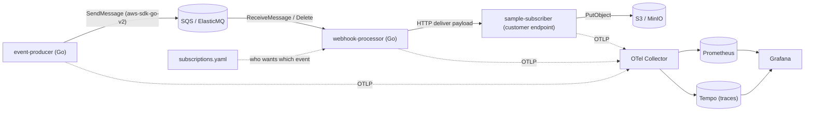
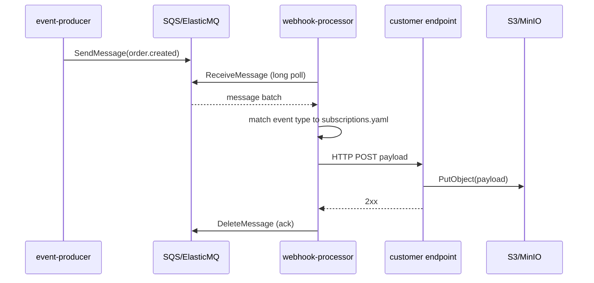

# Architecture - Hookwave Webhook Delivery Platform

Read this once before Sprint 0. It is the single source of truth for *what* the system is and *why*
the pieces exist. Sprint files reference back to sections here.

## 1. The model (real-webhook style, not internal RPC)

A webhook platform receives events and **delivers** them to endpoints that customers register.
We simulate that with three Go services plus infrastructure.

- **Service 1 - event-producer**: generates fake e-commerce order events
  (`order.created`, `order.updated`, `order.shipped`) and pushes them to a queue. Stands in for
  "something happened in our system."
- **Queue**: AWS SQS in the cloud; **ElasticMQ** (SQS-compatible) locally.
- **Service 2 - webhook-processor**: consumes events from the queue, looks up which customers
  subscribed to that event type (from `subscriptions.yaml`), and delivers the payload over HTTP
  to each subscriber's registered URL + method.
- **Service 3 - sample-subscriber**: a stand-in customer endpoint. Exposes an HTTP handler,
  receives deliveries, and stores each payload to **S3** (**MinIO** locally).

Delivery is **at-least-once** and best-effort for the core build. Retries / dead-letter queue /
HMAC signing are explicitly Nice-to-have (Section 9).

## 2. System diagram



## 3. End-to-end delivery sequence



Key learning point: the message is only **deleted (acked)** after successful processing. If the
processor crashes mid-delivery, SQS makes the message visible again after the *visibility timeout*,
so it is redelivered. That is what "at-least-once" means - and why subscribers should tolerate
duplicates.

## 4. Tech stack & key packages

- **Language**: Go 1.26.
- **AWS access**: `github.com/aws/aws-sdk-go-v2` (`service/sqs`, `service/s3`). The same SDK talks to
  ElasticMQ/MinIO by overriding `BaseEndpoint`, so your code stays AWS-deployable with no rewrite.
- **HTTP**: standard library `net/http`. Go 1.22+ has method-aware routing (`mux.HandleFunc("POST /x", ...)`),
  which is enough. Reach for `github.com/go-chi/chi` only if routing grows complex.
- **Config**: start with `gopkg.in/yaml.v3` + environment variables. Upgrade to `koanf` or `viper`
  only if config gets unwieldy.
- **Logging**: `go.uber.org/zap` via `internal/observability` (structured JSON logs, Winston/Pino-style API).
- **Observability**: OpenTelemetry Go SDK (`go.opentelemetry.io/otel` and the OTLP exporter),
  exporting to the collector inside `grafana/otel-lgtm`.
- **Testing**: standard library `testing` + `github.com/stretchr/testify`. `testcontainers-go` for
  integration tests is Nice-to-have.
- **Lint/format**: `gofmt`, `go vet`, `golangci-lint`.
- **Build helpers**: a `Makefile`.
- **Containers**: multi-stage Docker builds on a small base (distroless or alpine).

## 5. Monorepo layout

One Git repo, one Go module (simplest for a beginner), multiple binaries under `cmd/`, shared code
under `internal/`. This follows the widely used `golang-standards/project-layout` conventions.
A multi-module `go.work` split is Nice-to-have if you later want strict isolation.

```text
hookwave/
  cmd/
    producer/        main.go         # event-producer binary
    processor/       main.go         # webhook-processor binary
    subscriber/      main.go         # sample customer endpoint binary
  internal/
    events/          # event types + JSON marshaling (order.created, etc.)
    queue/           # SQS/ElasticMQ client wrapper (send/receive/delete)
    storage/         # S3/MinIO client wrapper (PutObject)
    config/          # load env + subscriptions.yaml
    subscriptions/   # subscription model + lookup by event type
    httpx/           # shared HTTP client/server helpers, middleware
    observability/   # zap logger + (later) OTel setup (one init shared by all 3 services)
  configs/
    subscriptions.yaml
  deploy/
    docker/          # one Dockerfile per service (or a shared multi-stage)
    compose/         # docker-compose.yaml (full local stack)
    helm/            # umbrella chart + per-service charts, KEDA ScaledObject
  docs/
    ARCHITECTURE.md  # a trimmed copy of this file lives in the repo proper
  plans/             # this planning directory
  Makefile
  go.mod
```

Why `internal/`: Go forbids importing `internal/` packages from outside the module, which keeps your
shared code private to this repo and forces clean boundaries.

## 6. Local environments (two paths, both intended)

**Path A - docker-compose (daily dev).** One `deploy/compose/docker-compose.yaml` runs:
ElasticMQ (`softwaremill/elasticmq-native`, API on 9324, UI on 9325 to avoid clashing with Grafana),
MinIO (API 9000, console 9001), `grafana/otel-lgtm` (Grafana 3000, OTLP gRPC 4317, OTLP HTTP 4318),
and the three Go services. `make up` brings the whole stack online. This is what you use 95% of the time.

**Path B - Kubernetes (scaling demo only).** A local `kind` cluster + Helm charts for the services,
ElasticMQ, and MinIO; KEDA installed to autoscale the processor on queue depth. You only need this in
Sprint 6 to demonstrate scaling - it is not your everyday loop.

KEDA's `aws-sqs-queue` trigger supports an `awsEndpoint` override, so it scales on an ElasticMQ queue
locally with no AWS account:

```yaml
triggers:
  - type: aws-sqs-queue
    metadata:
      queueURL: http://elasticmq:9324/000000000000/webhook-events
      awsRegion: elasticmq
      awsEndpoint: http://elasticmq:9324
      queueLength: "5"
```

## 7. Observability

Use the single open-source `grafana/otel-lgtm` image locally. It bundles the OpenTelemetry Collector,
Prometheus (metrics), Tempo (traces), Loki (logs), and Grafana (dashboards) in one container.

Each service:
- Emits **traces**: a producer span -> SQS -> a processor span -> HTTP -> a subscriber span, so you
  can see end-to-end latency and find the bottleneck (queue wait vs HTTP delivery vs S3 write).
- Emits **metrics**: throughput, delivery success/failure counts, queue receive latency.
- Sends OTLP to `http://otel-lgtm:4318` (HTTP) or `:4317` (gRPC); Grafana is at `:3000` (admin/admin).

This is exactly how you answer "where is the bottleneck - data layer or app layer?": compare span
durations across stages in Tempo, and watch rate/error/duration metrics in Prometheus via Grafana.

## 8. Cloud-readiness (AWS later - Nice-to-have)

Because we use the real `aws-sdk-go-v2`, moving to AWS means: drop the custom `BaseEndpoint`, supply
real credentials/region, provision real SQS + S3, and deploy the same Helm charts + KEDA to EKS.
Terraform IaC and EKS manifests are documented as Nice-to-have, not built in the core sprints.

## 9. Nice-to-have (explicitly optional, not mandated)

- **Reliability**: delivery retries with exponential backoff, a dead-letter queue, and an HMAC
  signature header on each delivery (so subscribers can verify authenticity).
- **Subscription management API + Postgres** to replace the YAML config.
- **Integration tests** with `testcontainers-go` against ElasticMQ/MinIO.
- **Loki** log correlation and log-based dashboards.
- **CI** with GitHub Actions (build, test, lint, image push).
- **AWS deployment**: Terraform for SQS/S3/IAM, EKS, ECR, real KEDA SQS scaling.
- **Multi-module `go.work`** split for stricter service isolation.
