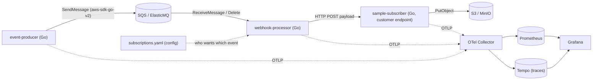
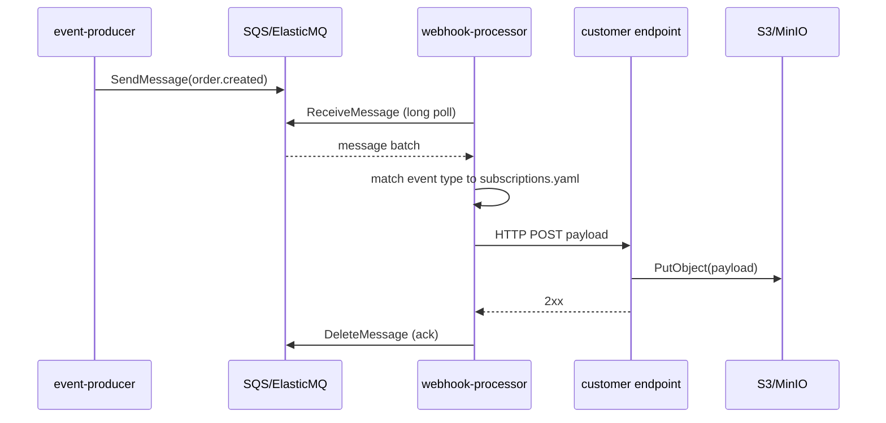

```markdown
---
name: Webhook platform plan
overview: "A Go monorepo for a webhook delivery platform: a fake event-producer (to ElasticMQ/SQS), a webhook-processor (SQS consumer that delivers events over HTTP to customer-registered endpoints), and a sample subscriber endpoint that stores received payloads to MinIO/S3 — fully containerized, observable (OpenTelemetry + Prometheus + Grafana), and scalable via Kubernetes + Helm + KEDA."
todos:
  - id: docs
    content: Rename Go module to chosen name and write docs/ARCHITECTURE.md with the architecture, diagrams, study topics, and sprint plan
    status: pending
  - id: scaffold
    content: Create monorepo layout (cmd/{producer,processor,subscriber}, internal/{events,queue,storage,config,subscriptions,httpx,observability}, configs, deploy, Makefile, golangci-lint)
    status: pending
  - id: producer
    content: "Sprint 1: docker-compose with ElasticMQ + internal/queue SQS wrapper + cmd/producer emitting fake order events"
    status: pending
  - id: processor
    content: "Sprint 2: cmd/processor consumes SQS, loads subscriptions.yaml, matches event types, acks messages"
    status: pending
  - id: subscriber
    content: "Sprint 3: cmd/subscriber HTTP endpoint storing payloads to MinIO + processor HTTP delivery (end-to-end flow)"
    status: pending
  - id: observability
    content: "Sprint 4: add grafana/otel-lgtm and wire OpenTelemetry traces+metrics across all three services with a Grafana dashboard"
    status: pending
  - id: containerize
    content: "Sprint 5: per-service multi-stage Dockerfiles, complete one-command compose stack, healthchecks, graceful shutdown"
    status: pending
  - id: k8s
    content: "Sprint 6: kind cluster + Helm charts + KEDA ScaledObject on processor (aws-sqs-queue trigger via awsEndpoint) demonstrating autoscaling"
    status: pending
isProject: false
---

# Webhook Delivery Platform - Architecture & Delivery Plan

This plan is written for a Go beginner. The first deliverable is a `docs/ARCHITECTURE.md` containing everything below (with the mermaid diagrams), followed by an incremental, test-as-you-go build. Nothing extra is mandated; optional items are in Nice-to-have.

## 1. Project name suggestion

Primary recommendation: **Hookwave**. Short, memorable, clearly about webhooks, unused enough to be a clean Go module path (`github.com/<you>/hookwave`).

Alternates if you prefer: `Courier`, `Hermes`, `Relaykit`, `Outpost`, `Pigeon`.

Note: the current `go.mod` module is `golang-microservices`; we will rename it to the chosen name. Tell me your pick (or I'll default to `hookwave`).

## 2. What we are building (corrected model)

This is a real-webhook-style system, not RPC between internal services:

- Service 1 - event-producer: generates fake e-commerce order events (`order.created`, `order.updated`, `order.shipped`) and sends them to a queue.
- Queue: AWS SQS in the cloud; ElasticMQ (SQS-compatible) locally.
- Service 2 - webhook-processor: consumes from the queue, looks up which customers subscribed to that event type (from a config file), and delivers the payload over HTTP to each customer's registered endpoint + method.
- Service 3 - sample-subscriber (a stand-in "customer endpoint"): exposes an HTTP endpoint, receives deliveries, and stores each payload to S3 (MinIO locally).

Delivery is at-least-once and best-effort for the core build. Retries/DLQ/HMAC signing are Nice-to-have.



Delivery sequence:



## 3. Tech stack & key packages

- Language: Go 1.26 (already in `go.mod`).
- AWS access: `github.com/aws/aws-sdk-go-v2` (sqs + s3) - same SDK works against ElasticMQ/MinIO via a custom `BaseEndpoint`, so code stays AWS-deployable.
- HTTP: standard library `net/http` (Go 1.22+ routing is enough; `chi` only if routing gets complex).
- Config: `koanf` (or `viper`) to load `subscriptions.yaml` + env. Beginner-friendly: start with stdlib `encoding/json`/`gopkg.in/yaml.v3` + env, upgrade if needed.
- Logging: stdlib `log/slog` (structured logging, modern, no deps).
- Observability: OpenTelemetry Go SDK (`go.opentelemetry.io/otel`) exporting OTLP to the Collector.
- Testing: stdlib `testing` + `testify` (asserts); `testcontainers-go` for integration tests against ElasticMQ/MinIO (Nice-to-have).
- Lint/format: `gofmt`, `go vet`, `golangci-lint`.
- Build/run helpers: a `Makefile` (or `Taskfile`).
- Containers: multi-stage Docker builds on a small base (distroless/alpine).

## 4. Monorepo layout

Single Git repo, single Go module (simplest for a beginner), multiple binaries under `cmd/`, shared code under `internal/`. Follows the widely used `golang-standards/project-layout` conventions. (We can switch to multi-module `go.work` later if strict isolation is wanted - Nice-to-have.)

```text
hookwave/
  cmd/
    producer/        main.go         # event-producer binary
    processor/       main.go         # webhook-processor binary
    subscriber/      main.go         # sample customer endpoint binary
  internal/
    events/          # event types + JSON (order.created, etc.)
    queue/           # SQS/ElasticMQ client wrapper (send/receive/delete)
    storage/         # S3/MinIO client wrapper (PutObject)
    config/          # load env + subscriptions.yaml
    subscriptions/   # subscription model + lookup by event type
    httpx/           # shared HTTP client/server helpers, middleware
    observability/   # OTel + slog setup (one init used by all 3 services)
  configs/
    subscriptions.yaml
  deploy/
    docker/          # one Dockerfile per service (or a shared multi-stage)
    compose/         # docker-compose.yaml (full local stack)
    helm/            # umbrella chart + per-service charts, KEDA ScaledObject
  docs/
    ARCHITECTURE.md  # this document + diagrams
  Makefile
  go.mod
```

## 5. Local environments (two paths, both requested)

Path A - docker-compose (fast everyday dev): one `deploy/compose/docker-compose.yaml` running ElasticMQ (`softwaremill/elasticmq-native`, port 9324 + UI 3000), MinIO, `grafana/otel-lgtm` (ports 3000-Grafana/4317/4318), and the three Go services. `make up` brings it all online.

Path B - Kubernetes for the scaling demo (kind + Helm + KEDA):
- Local cluster via `kind` (or `k3d`).
- `helm` charts in `deploy/helm/` for the three services + ElasticMQ + MinIO.
- Install KEDA, then a `ScaledObject` on the processor using the `aws-sqs-queue` trigger pointed at ElasticMQ via `awsEndpoint` (confirmed supported):

```yaml
triggers:
  - type: aws-sqs-queue
    metadata:
      queueURL: http://elasticmq:9324/000000000000/webhook-events
      awsRegion: elasticmq
      awsEndpoint: http://elasticmq:9324
      queueLength: "5"
```

The producer can burst messages to demonstrate KEDA scaling processor replicas up/down with queue depth.

## 6. Observability

Use the single open-source `grafana/otel-lgtm` image locally (OTel Collector + Prometheus + Tempo + Loki + Grafana in one container). Each service:
- Emits traces (producer span -> SQS -> processor span -> HTTP -> subscriber span) so you can see end-to-end latency and find bottlenecks (queue wait vs HTTP delivery vs S3 write).
- Emits metrics (throughput, delivery success/failure, queue receive latency) scraped/pushed to Prometheus.
- Grafana dashboards visualize where time is spent (data layer vs app layer).

## 7. Cloud-readiness (AWS later - Nice-to-have scope)

Because we use real `aws-sdk-go-v2`, moving to AWS = swap endpoints/credentials (drop the custom `BaseEndpoint`), provision real SQS + S3, and deploy to EKS with the same Helm charts + KEDA. Terraform IaC and EKS manifests are documented as Nice-to-have, not built in the core sprints.

## 8. Go topics to study before/with implementation

In rough priority order:
- Go fundamentals: packages, `go.mod`/modules, types, structs, slices/maps, errors.
- Interfaces and composition (key for the `queue`/`storage` wrappers).
- `encoding/json` and struct tags; `gopkg.in/yaml.v3` for config.
- `net/http` server and client (handlers, `http.Client`, timeouts).
- Concurrency: goroutines, channels, `sync.WaitGroup`, and especially `context.Context` for cancellation/timeouts.
- Graceful shutdown (signal handling + context).
- Structured logging with `log/slog`.
- Testing in Go: `testing`, table-driven tests, `testify`.
- aws-sdk-go-v2 basics: config, custom endpoints, SQS send/receive/delete, S3 PutObject.
- Docker multi-stage builds for Go.
- Kubernetes basics (Pod/Deployment/Service), Helm chart structure, and KEDA concepts.
- OpenTelemetry concepts: traces, spans, metrics, OTLP exporter.

## 9. Sprint plan (sequence + estimated hours)

Estimates assume a learning pace; pair each sprint's coding with the matching study topics above.

- Sprint 0 - Foundations & docs (6-9h)
  - Write `docs/ARCHITECTURE.md` (this content + diagrams), rename module to chosen name, set up repo layout, Makefile, `.gitignore`, golangci-lint. Outcome: skeleton compiles.
- Sprint 1 - Producer + local queue (8-12h)
  - docker-compose with ElasticMQ; `internal/queue` SQS wrapper; `cmd/producer` sends fake order events on an interval/burst. Verify in ElasticMQ UI.
- Sprint 2 - Processor consume + subscriptions (10-14h)
  - `cmd/processor` long-polls SQS, parses events, loads `subscriptions.yaml`, matches event type. Log matched deliveries (no HTTP yet). Ack/delete on success.
- Sprint 3 - Subscriber + S3 delivery (10-14h)
  - `cmd/subscriber` HTTP endpoint + MinIO `PutObject`; processor delivers via HTTP to subscriber. End-to-end: producer -> queue -> processor -> subscriber -> MinIO.
- Sprint 4 - Observability (10-14h)
  - Add `grafana/otel-lgtm`; wire OTel traces+metrics in all three services; build a Grafana dashboard showing throughput and per-stage latency.
- Sprint 5 - Containerize fully + compose polish (6-10h)
  - Per-service multi-stage Dockerfiles; complete one-command compose stack; healthchecks; graceful shutdown.
- Sprint 6 - Kubernetes + Helm + KEDA (12-18h)
  - kind cluster; Helm charts for services + ElasticMQ + MinIO; install KEDA; `ScaledObject` on processor; demonstrate autoscaling under a producer burst.

Rough total core: ~62-91 hours.

## 10. Nice-to-have (not mandated)

- Reliability: delivery retries with exponential backoff, dead-letter queue, HMAC signature header on delivery.
- Subscription management API + Postgres (replace the YAML config).
- Integration tests with `testcontainers-go`.
- Loki log correlation + log-based dashboards.
- CI with GitHub Actions (build, test, lint, image push).
- AWS deployment: Terraform for SQS/S3/IAM, EKS, ECR, real KEDA SQS scaling.
- Multi-module `go.work` split if stricter service isolation is desired.

## Open item before building

Confirm the project name (default `hookwave` if you don't mind). Everything else is decided.
```

